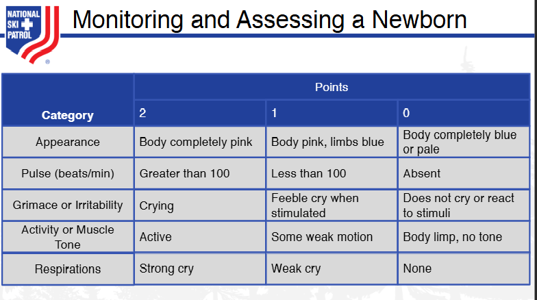

    
# Nsp Oec Training Chapter 17 

## National Ski Patrol - Outdoor Emergency Care chapter 17

    

    

## Chapter 17: Childbirth, Obstetric Emergencies, and Sexual Assault

1.  Explain the normal reproductive cycle of a woman.
2.  List normal changes in vital signs a women experiences during pregnancy.
3.  Explain how to take a blood pressure in a pregnant woman.
4.  Describe what happens to the mother and fetus during shock.
5.  Describe the three trimesters of a normal pregnancy.
6.  Describe possible complications of pregnancy.
7.  Demonstrate how to examine a female patient with abdominal or pelvic pain.
8.  Describe the special considerations that are needed when using spinal motion restriction for a pregnant woman.
9.  Describe the management of a pregnant patient with abdominal trauma.
10.  Describe and demonstrate the process of assisting a woman during a delivery.
11.  Explain what to do when there is a possible sexual assault of a woman.
12.  Describe the basic care for a newborn.

## 17.1 Explain the normal reproductive cycle of a woman.

The normal reproductive cycle of a woman, also known as the **menstrual cycle**, is a regular natural process that prepares the body for pregnancy. It typically lasts around **28 days** but can vary from **21 to 35 days** in different individuals. The cycle is controlled by hormones and involves the following key phases:

### 1. **Menstrual Phase (Days 1–5)**
   - **What Happens**: This phase marks the beginning of the menstrual cycle. If the previous cycle did not result in pregnancy, the **lining of the uterus (endometrium)** sheds, leading to menstrual bleeding. 
   - **Hormones**: Levels of **estrogen** and **progesterone** are low, which triggers the shedding of the uterine lining.
   - **Duration**: Typically lasts **3 to 7 days**, depending on the individual.

### 2. **Follicular Phase (Days 1–13)**
   - **What Happens**: This phase overlaps with the menstrual phase and continues afterward. The **pituitary gland** in the brain releases **follicle-stimulating hormone (FSH)**, which stimulates the ovaries to produce **several follicles**. Each follicle contains an immature egg, but usually, only one becomes dominant and matures fully.
   - **Endometrium Growth**: The uterus starts to prepare for a potential pregnancy by thickening its lining (endometrium) as a result of rising **estrogen** levels produced by the developing follicles.
   - **Hormones**: **FSH** promotes follicle development, while **estrogen** helps in rebuilding and thickening the uterine lining.

### 3. **Ovulation Phase (Day 14)**
   - **What Happens**: Ovulation occurs when the **dominant follicle releases a mature egg** from the ovary into the **fallopian tube**. This is the most fertile period in the cycle, and the egg can be fertilized if it meets sperm in the fallopian tube.
   - **Hormones**: A surge in **luteinizing hormone (LH)**, triggered by rising estrogen levels, causes the release of the egg. This LH surge is what signals ovulation.
   - **Timing**: Ovulation generally occurs **mid-cycle**, around **day 14** in a 28-day cycle, but this can vary depending on the length of the cycle.

### 4. **Luteal Phase (Days 15–28)**
   - **What Happens**: After the egg is released, the empty follicle transforms into a structure called the **corpus luteum**, which secretes **progesterone**. Progesterone maintains and thickens the uterine lining, making it more suitable for implantation of a fertilized egg.
   - **Possible Outcomes**:
     - **If Fertilization Occurs**: The fertilized egg travels to the uterus and implants into the thickened lining. The body then continues to produce progesterone to support early pregnancy.
     - **If Fertilization Does Not Occur**: The corpus luteum breaks down, leading to a drop in progesterone and estrogen levels, which causes the uterine lining to shed, beginning a new menstrual cycle.
   - **Hormones**: **Progesterone** is the dominant hormone during this phase, maintaining the uterine lining.

### Summary of Hormonal Control:
1. **FSH**: Stimulates the growth of ovarian follicles.
2. **Estrogen**: Rebuilds the uterine lining and triggers the LH surge.
3. **LH**: Causes ovulation.
4. **Progesterone**: Maintains the uterine lining in preparation for a fertilized egg.

### Cycle Recap:
- **Days 1–5**: **Menstrual Phase** - Shedding of the uterine lining.
- **Days 1–13**: **Follicular Phase** - Development of follicles, rebuilding of the uterine lining.
- **Day 14**: **Ovulation Phase** - Release of the mature egg.
- **Days 15–28**: **Luteal Phase** - Preparation for potential pregnancy, maintenance of the uterine lining.

Understanding the menstrual cycle is important for tracking fertility, managing reproductive health, and recognizing when something may be irregular, indicating a potential health issue.

## 17.2 List normal changes in vital signs a women experiences during pregnancy.

During pregnancy, a woman’s body undergoes significant physiological changes, including alterations in vital signs. These changes are normal and are the body’s way of adapting to support both the mother and the growing fetus. Here are the typical changes in vital signs during pregnancy:

### 1. **Heart Rate (Pulse)**
   - **Increase**: The heart rate usually increases by **10–15 beats per minute (bpm)**, especially in the second and third trimesters.
   - **Reason**: The heart works harder to pump the increased volume of blood circulating in the body (about 30–50% more blood volume). This increase is necessary to provide sufficient oxygen and nutrients to the fetus and placenta.

### 2. **Blood Pressure**
   - **First and Second Trimesters**: Blood pressure may **decrease** slightly during early and mid-pregnancy. 
     - **Reason**: Hormonal changes cause the blood vessels to relax (vasodilation), leading to lower blood pressure.
   - **Third Trimester**: Blood pressure typically returns to **pre-pregnancy levels**.
     - **Note**: A significant increase in blood pressure, especially after the 20th week of pregnancy, could indicate **preeclampsia**, a serious condition requiring medical attention.

### 3. **Respiratory Rate**
   - **Slight Increase or No Change**: The respiratory rate may remain relatively **unchanged** or slightly **increase**.
   - **Reason**: There is a need for increased oxygen intake to meet the demands of the growing fetus and placenta. Although the rate may not change much, the depth of breathing often increases (tidal volume), which helps to improve oxygen exchange.

### 4. **Temperature**
   - **Slight Increase**: Basal body temperature may be **slightly higher** than normal, especially in the first trimester.
   - **Reason**: Increased metabolic activity and hormonal changes (mainly due to **progesterone**) can cause a mild rise in body temperature. 

### 5. **Oxygen Saturation**
   - **Generally Unchanged**: Oxygen saturation levels typically **remain stable** throughout pregnancy.
   - **Note**: Even though respiratory adjustments are made, the body efficiently adapts to maintain normal oxygen levels for both the mother and fetus.

### 6. **Weight**
   - **Gradual Increase**: Weight gain is a normal and expected change during pregnancy.
     - **Typical Weight Gain**: The average weight gain for a full-term pregnancy is about **25–35 pounds** (11–16 kg), but this can vary depending on the individual’s pre-pregnancy weight and overall health.

### Summary of Normal Changes:
| **Vital Sign**         | **Normal Change During Pregnancy**                        |
|------------------------|-----------------------------------------------------------|
| **Heart Rate**         | Increases by 10–15 bpm                                    |
| **Blood Pressure**     | Slight decrease in early pregnancy, returns to baseline by third trimester |
| **Respiratory Rate**   | Slight increase or remains stable, with increased tidal volume |
| **Temperature**        | Mild increase due to metabolic and hormonal changes       |
| **Oxygen Saturation**  | Remains generally unchanged                               |
| **Weight**             | Gradual increase, average gain of 25–35 pounds            |

These changes are part of the body’s adaptation to pregnancy, and while they are typically normal, significant deviations (e.g., very high blood pressure, rapid weight gain, or shortness of breath) may require further evaluation to ensure the health and safety of both the mother and the fetus.

## 17.3 Explain how to take a blood pressure in a pregnant woman.

Taking blood pressure in a pregnant woman is similar to the standard procedure for measuring blood pressure but with special considerations to ensure accurate results and the safety of both the mother and the fetus. Here is how to do it:

### Equipment Needed:
- **Blood pressure cuff** (sphygmomanometer)
- **Stethoscope**
- **Chair or bed with a backrest**
- **Table or arm support** at heart level

### Steps to Measure Blood Pressure in a Pregnant Woman:

1. **Prepare the Patient**:
   - Ensure the patient is **comfortable, calm, and relaxed**. She should be seated or lying down for at least **5 minutes** before the measurement.
   - The room should be **quiet** to avoid distractions.
   - **Advise the patient not to talk** during the procedure, as this can influence the reading.

2. **Position the Patient Properly**:
   - If she is **seated**, her **feet should be flat on the floor**, and her **back should be supported**.
   - If she is **lying down**, she should lie on her **left side** or **semi-recumbent** (propped up at a 45-degree angle) to avoid compressing the inferior vena cava, which can affect blood pressure readings.
     - **Note**: The left lateral position is particularly important in the **third trimester** to prevent a condition called **supine hypotensive syndrome**.

3. **Position the Arm**:
   - Ensure the **arm is at heart level**. It should be supported on a table or armrest, and the **elbow slightly bent**.
   - The **palm should face upwards**, and the arm should be free of tight clothing that could restrict blood flow.
   - Measure blood pressure on the **right arm**, as this is generally recommended for consistency.

4. **Apply the Blood Pressure Cuff**:
   - Choose a **properly sized cuff**. The cuff should cover **80% of the upper arm** and be wide enough to ensure an accurate reading. 
     - **Too small** or **too large** cuffs can lead to incorrect readings.
   - Wrap the cuff snugly around the **upper arm**, about **1 inch (2.5 cm) above the elbow**. The artery marker on the cuff should be aligned with the **brachial artery**.

5. **Measure the Blood Pressure**:
   - **Palpate the brachial artery**: Place your fingers on the inside of the elbow to feel the brachial pulse.
   - Inflate the cuff to about **20–30 mmHg above** where the pulse disappears (or if known, **20 mmHg above the expected systolic pressure**).
   - **Place the stethoscope’s diaphragm** over the brachial artery, just below the cuff.
   - **Slowly release** the pressure in the cuff (at a rate of about **2–3 mmHg per second**) while listening through the stethoscope.
   - Note the **systolic pressure** (the first sound you hear) and the **diastolic pressure** (when the sound disappears).

6. **Record the Reading**:
   - Write down the **systolic/diastolic** reading (e.g., 120/80 mmHg).
   - Note the **position of the patient** (sitting, lying down), and the **arm** used (right or left).

### Special Considerations During Pregnancy:
- **Measure blood pressure consistently on the same arm**: This helps to monitor any changes more accurately.
- **Avoid measuring in a supine (flat on the back) position**: Especially in the second and third trimesters, lying flat can compress the inferior vena cava, leading to **lower blood pressure readings** and discomfort for the patient.
- **Be mindful of white coat hypertension**: Anxiety about medical visits can cause temporarily elevated readings. If readings are high, consider taking multiple readings over a few minutes, or using a home blood pressure monitor for regular monitoring.

### Tips for Accuracy:
- Take at least **two readings, spaced 1–2 minutes apart**, and record the average.
- Ensure the **patient has not consumed caffeine or smoked** within **30 minutes** of the reading, as this can affect blood pressure.
- Be consistent with the **time of day** when measuring blood pressure, as there can be natural fluctuations throughout the day.

### Importance in Pregnancy:
Monitoring blood pressure is crucial during pregnancy because **hypertension** can indicate conditions like **gestational hypertension**, **preeclampsia**, or **eclampsia**, which can have serious consequences for both the mother and baby. Regular monitoring helps in early detection and appropriate management of these conditions.

## 17.4  Describe what happens to the mother and fetus during shock.

Shock is a critical condition where there is inadequate blood flow to the tissues, leading to insufficient oxygen and nutrient delivery to cells. During pregnancy, shock can have serious consequences for both the mother and the fetus. Here’s what happens to each:

### Effects of Shock on the Mother
1. **Cardiovascular System**:
   - **Decreased Blood Pressure**: Shock causes a significant drop in blood pressure due to reduced blood volume, heart function, or blood vessel tone.
   - **Increased Heart Rate (Tachycardia)**: The body attempts to compensate by increasing the heart rate to maintain blood flow to vital organs.
   - **Vasoconstriction**: Blood vessels constrict to preserve blood flow to critical organs (brain and heart), leading to reduced blood flow to less vital areas.

2. **Respiratory System**:
   - **Increased Breathing Rate (Tachypnea)**: The mother’s breathing becomes rapid and shallow in an attempt to increase oxygen intake.
   - **Decreased Oxygen Saturation**: With the progression of shock, there is less oxygen circulating in the blood, leading to hypoxia (low oxygen levels).

3. **Skin and Extremities**:
   - **Pale, Cold, and Clammy Skin**: Reduced blood flow leads to vasoconstriction, making the skin feel cold and appear pale or bluish. Sweating is also common.
   - **Delayed Capillary Refill**: Pressing on the skin and releasing it will show a slower return of normal color (more than 2 seconds).

4. **Kidneys and Urinary Output**:
   - **Reduced Urine Output (Oliguria or Anuria)**: The kidneys receive less blood, leading to decreased urine production as the body tries to conserve fluids.
   - **Risk of Acute Kidney Injury**: Prolonged shock can cause damage to the kidneys due to lack of oxygen.

5. **Nervous System**:
   - **Altered Mental State**: As shock progresses, the mother may experience confusion, restlessness, anxiety, or loss of consciousness due to reduced oxygen to the brain.
   - **Dizziness or Fainting**: Decreased blood flow to the brain can cause these symptoms.

6. **Uterus and Placenta**:
   - **Reduced Uterine Blood Flow**: Blood flow to the uterus decreases, which can compromise the health of the fetus.
   - **Potential Risk of Uterine Atony**: After childbirth, shock can lead to uterine atony, where the uterus does not contract properly, increasing the risk of postpartum hemorrhage.

### Effects of Shock on the Fetus
1. **Reduced Oxygen and Nutrient Supply**:
   - The fetus relies on the placenta for oxygen and nutrients, which are supplied by the mother's blood. During shock, the mother’s body prioritizes blood flow to her vital organs (heart and brain), leading to **reduced blood flow to the placenta**.
   - This can cause **fetal hypoxia** (low oxygen levels), which can result in distress, abnormal fetal heart rate patterns, and potential long-term complications.

2. **Fetal Heart Rate Changes**:
   - **Tachycardia** (increased fetal heart rate): Initially, the fetus may respond to low oxygen levels by increasing its heart rate.
   - **Bradycardia** (decreased fetal heart rate): If shock persists, the fetus can develop bradycardia, indicating severe distress.
   - **Variable or Late Decelerations**: Abnormal heart rate patterns seen on fetal monitoring that suggest impaired oxygenation.

3. **Risk of Premature Birth**:
   - Shock can trigger **premature labor**, as the body may initiate labor due to stress and reduced placental function. This is a protective mechanism to save the fetus if the uterine environment becomes too hostile.
   - Premature birth comes with its own risks, including respiratory distress and other complications for the baby.

4. **Intrauterine Growth Restriction (IUGR)**:
   - Chronic or prolonged shock conditions (such as maternal conditions leading to repeated episodes of low blood pressure or poor perfusion) can lead to **poor fetal growth**. The fetus does not receive enough nutrients and oxygen to develop properly, resulting in a smaller size.

5. **Fetal Demise**:
   - In severe cases, especially if shock is prolonged or untreated, there is a risk of **fetal death**. This can occur due to prolonged hypoxia, acidosis (build-up of acid due to lack of oxygen), or placental abruption (separation of the placenta from the uterus).

### Types of Shock and Their Impact
1. **Hypovolemic Shock** (e.g., from hemorrhage):
   - Common in pregnancy due to conditions like **placental abruption, uterine rupture, or postpartum hemorrhage**.
   - Can lead to significant blood loss, reducing the mother’s ability to supply blood to the fetus.

2. **Septic Shock** (e.g., from severe infection):
   - Infection during pregnancy can lead to septic shock, where widespread inflammation causes blood vessel dilation and reduced blood pressure.
   - Both mother and fetus are at risk if there is a systemic infection.

3. **Cardiogenic Shock** (e.g., from heart failure):
   - Occurs when the heart cannot pump enough blood, which may be due to underlying heart disease or complications during pregnancy.
   - Decreased cardiac output affects blood supply to the placenta and fetus.

### Management Considerations
- **Stabilize the Mother First**: Immediate management focuses on **stabilizing the mother**, as improving her condition will directly benefit the fetus.
- **IV Fluids and Blood Transfusions**: For hypovolemic shock, prompt administration of fluids and blood products is essential.
- **Monitor Fetal Well-being**: Continuous **fetal heart rate monitoring** is important to assess how the fetus is responding.
- **Early Delivery if Necessary**: In severe cases, especially if the fetus is in distress, early delivery might be considered to save the baby.

### Summary
In summary, shock during pregnancy is a medical emergency that affects both the mother and fetus. The mother's body undergoes physiological changes to prioritize blood flow to vital organs, often at the expense of uterine blood flow. This can lead to reduced oxygen and nutrient delivery to the fetus, causing distress, abnormal heart rate patterns, and potentially premature labor or fetal demise. Prompt recognition and treatment of shock are crucial to improving outcomes for both mother and baby.

## 17.5 Describe the three trimesters of a normal pregnancy.

A normal pregnancy is typically divided into **three trimesters**, each lasting about **three months**. During these trimesters, the mother’s body and the developing fetus undergo significant changes. Here’s an overview of what happens in each trimester:

### **First Trimester (Weeks 1–12)**
The first trimester begins from the moment of conception and lasts through the **12th week** of pregnancy. This is a critical period for the development of the baby.

#### **Maternal Changes:**
- **Hormonal Shifts**: The body produces increased levels of hormones like **estrogen** and **progesterone** to support pregnancy. These hormones are responsible for many of the physical and emotional changes.
- **Common Symptoms**:
  - **Morning Sickness**: Nausea and vomiting, often most severe during the first trimester, but can occur at any time of day.
  - **Fatigue**: Increased tiredness as the body adapts to pregnancy.
  - **Breast Tenderness**: Breasts may become sore, swollen, and more sensitive.
  - **Frequent Urination**: The expanding uterus begins to press on the bladder, causing frequent urination.
  - **Food Cravings or Aversions**: Changes in appetite, cravings for certain foods, or aversions to others.

#### **Fetal Development:**
- **Weeks 1–4**: After fertilization, the fertilized egg (zygote) travels down the fallopian tube and implants in the uterine wall. The cells begin to divide and form an **embryo**.
- **Weeks 5–8**: Major organs and body systems start to form, including the heart, brain, spinal cord, and lungs. By the end of the 8th week, the embryo has arms, legs, and fingers.
- **Weeks 9–12**: The embryo is now referred to as a **fetus**. The major organs continue to develop, and the fetus begins to look more human. The **heartbeat** can be detected on an ultrasound.

### **Second Trimester (Weeks 13–26)**
The second trimester is often considered the most comfortable phase for many women, as early symptoms like nausea typically subside, and energy levels may improve. This period spans from the **13th to the 26th week**.

#### **Maternal Changes:**
- **Reduced Morning Sickness**: Nausea and vomiting usually decrease.
- **Increased Energy**: Many women report feeling more energetic.
- **Growing Belly**: The **uterus expands** beyond the pelvis, and the abdomen starts to grow more visibly.
- **Feeling Fetal Movements**: Around **18–20 weeks**, many women begin to feel the baby move (quickening).
- **Breast Enlargement**: Breasts continue to grow, and the **areolae** (the dark area around the nipples) may darken.
- **Skin Changes**: The skin may show changes like the **linea nigra** (a dark line running from the belly button down to the pubic bone) and **stretch marks**.

#### **Fetal Development:**
- **Weeks 13–16**: The fetus continues to grow and develop. Facial features, like **eyes and ears**, move into their correct positions. The fetus can make **movements**, although they may not yet be felt by the mother.
- **Weeks 17–20**: The fetus becomes more active, and movements are often felt by the mother. The **skeleton** starts to harden, and the fetus can **hear sounds**.
- **Weeks 21–26**: The fetus continues to grow rapidly. The **lungs** begin to develop air sacs (though they are not yet functional), and the baby may start to respond to external stimuli like sounds and light. The **brain** and **nervous system** continue to mature.

### **Third Trimester (Weeks 27–40)**
The third trimester is the final stage of pregnancy, from **week 27 until birth** (around week 40). During this period, the fetus gains most of its weight and prepares for life outside the womb.

#### **Maternal Changes:**
- **Rapid Weight Gain**: As the baby grows, the mother’s weight increases.
- **Increased Discomfort**: Due to the size and weight of the baby, women may experience **back pain, leg cramps, swelling (edema)**, and **shortness of breath**.
- **Braxton Hicks Contractions**: These are **irregular, mild contractions** that prepare the uterus for labor, often called "practice contractions."
- **Frequent Urination**: The growing uterus presses on the bladder, leading to more frequent trips to the bathroom.
- **Preparation for Labor**: The body begins to prepare for delivery, with changes like the **softening of the cervix** and the baby "dropping" lower into the pelvis (lightening).

#### **Fetal Development:**
- **Weeks 27–30**: The fetus continues to grow and develop fat beneath the skin, which helps with temperature regulation after birth. **Brain development** is rapid, and the fetus may be able to open and close its eyes.
- **Weeks 31–35**: The fetus gains weight quickly, and organs continue to mature. The **lungs** develop further, though full maturity may not be reached until later in the third trimester. The baby’s movements are stronger and more coordinated.
- **Weeks 36–40**: The fetus moves into a **head-down position** (in preparation for birth), though this can vary. By **week 37**, the pregnancy is considered **full term**. The baby’s organs, particularly the lungs, are fully mature, and the fetus continues to gain weight until birth.

### Summary of Key Changes:
| **Trimester**     | **Maternal Changes**                                           | **Fetal Development**                              |
|-------------------|---------------------------------------------------------------|----------------------------------------------------|
| **First (1–12 weeks)**  | Nausea, fatigue, breast tenderness, frequent urination        | Development of major organs, formation of embryo   |
| **Second (13–26 weeks)** | Energy boost, growing belly, feeling fetal movements          | Rapid growth, organ maturation, movement felt      |
| **Third (27–40 weeks)**  | Weight gain, discomfort, Braxton Hicks contractions, preparation for labor | Final weight gain, full organ maturity, head-down position |

### Conclusion:
Each trimester brings unique changes and developments for both the mother and the fetus. Regular **prenatal care** is essential throughout pregnancy to monitor the health of both and address any complications that may arise. Understanding the progression of a normal pregnancy can help expectant mothers prepare for what to expect and recognize any potential concerns early.

## 17.6  Describe possible complications of pregnancy.

Pregnancy is a complex process, and while many pregnancies progress without significant issues, complications can arise that affect the health of both the mother and the fetus. Some complications are mild, while others can be serious and may require immediate medical attention. Here are some possible complications of pregnancy:

### 1. **Gestational Diabetes**
   - **Description**: A type of diabetes that develops during pregnancy, usually in the second or third trimester. It involves high blood sugar levels that can affect the health of both mother and baby.
   - **Risk Factors**: Obesity, advanced maternal age, family history of diabetes, previous gestational diabetes.
   - **Possible Complications**: 
     - For the mother: Increased risk of preeclampsia, cesarean delivery, and developing type 2 diabetes later in life.
     - For the baby: Excessive birth weight (macrosomia), premature birth, respiratory distress, and a higher risk of developing obesity or diabetes in the future.

### 2. **Preeclampsia**
   - **Description**: A condition characterized by **high blood pressure** and signs of damage to another organ system, usually the kidneys or liver, that develops after the 20th week of pregnancy.
   - **Symptoms**: Severe headaches, visual disturbances, swelling (especially in the hands and face), sudden weight gain, and abdominal pain.
   - **Possible Complications**:
     - For the mother: Risk of seizures (eclampsia), stroke, organ damage, and HELLP syndrome (a life-threatening liver and blood clotting disorder).
     - For the baby: Poor growth, preterm birth, low birth weight, and placental abruption.

### 3. **Placenta Previa**
   - **Description**: A condition where the placenta partially or completely covers the **cervix**, which can cause severe bleeding during pregnancy or delivery.
   - **Symptoms**: Painless vaginal bleeding, typically during the second or third trimester.
   - **Possible Complications**:
     - For the mother: Risk of heavy bleeding (hemorrhage) during delivery, which may necessitate a cesarean section.
     - For the baby: Premature birth and low birth weight if delivery needs to be done early to avoid complications.

### 4. **Placental Abruption**
   - **Description**: When the placenta detaches partially or completely from the uterine wall before delivery, leading to a lack of oxygen and nutrients for the baby.
   - **Symptoms**: Sudden abdominal pain, vaginal bleeding, uterine tenderness, and contractions.
   - **Possible Complications**:
     - For the mother: Severe bleeding, shock, risk of disseminated intravascular coagulation (DIC).
     - For the baby: Preterm birth, low birth weight, stillbirth, and fetal distress.

### 5. **Preterm Labor**
   - **Description**: Labor that begins before **37 weeks** of pregnancy, leading to the birth of a premature baby.
   - **Risk Factors**: Previous preterm birth, multiple pregnancies (twins, triplets), infections, uterine or cervical issues.
   - **Possible Complications**:
     - For the baby: Respiratory problems, feeding difficulties, neurological disorders, and increased risk of developmental delays.

### 6. **Ectopic Pregnancy**
   - **Description**: A pregnancy in which the fertilized egg implants outside the uterus, usually in a **fallopian tube**. This type of pregnancy is not viable and can cause life-threatening complications for the mother.
   - **Symptoms**: Sharp, stabbing abdominal pain, vaginal bleeding, shoulder pain, and dizziness or fainting.
   - **Possible Complications**:
     - For the mother: Risk of fallopian tube rupture, internal bleeding, and shock. Immediate medical intervention is required.

### 7. **Hyperemesis Gravidarum**
   - **Description**: Severe, persistent **nausea and vomiting** during pregnancy, which can lead to dehydration, weight loss, and electrolyte imbalances.
   - **Symptoms**: Extreme nausea, inability to keep food or liquids down, weight loss, and dehydration.
   - **Possible Complications**:
     - For the mother: Risk of malnutrition, dehydration, and electrolyte imbalances.
     - For the baby: Potential for low birth weight and preterm birth if severe and untreated.

### 8. **Miscarriage (Spontaneous Abortion)**
   - **Description**: The spontaneous loss of a pregnancy before the **20th week**. Most miscarriages occur in the first trimester.
   - **Symptoms**: Vaginal bleeding, cramping, and the passage of tissue from the vagina.
   - **Possible Complications**:
     - Emotional and psychological impact on the mother and family. In some cases, if tissue remains, a procedure called a **dilation and curettage (D&C)** may be required.

### 9. **Gestational Hypertension**
   - **Description**: High blood pressure that develops during pregnancy but without the additional symptoms of preeclampsia.
   - **Possible Complications**:
     - For the mother: Risk of developing preeclampsia.
     - For the baby: Preterm birth, low birth weight, and complications related to high blood pressure.

### 10. **Infections During Pregnancy**
   - **Examples**: **Urinary tract infections (UTIs)**, **Group B Streptococcus (GBS)**, **Zika virus**, **Listeria**, **Toxoplasmosis**, and **Cytomegalovirus (CMV)**.
   - **Possible Complications**:
     - For the mother: Depending on the infection, symptoms can range from mild discomfort to severe illness.
     - For the baby: Risk of congenital infections, birth defects, miscarriage, preterm birth, and other complications depending on the type of infection.

### 11. **Amniotic Fluid Abnormalities**
   - **Too Little Amniotic Fluid (Oligohydramnios)**:
     - Can cause issues with the baby’s growth, lung development, and lead to complications during delivery.
   - **Too Much Amniotic Fluid (Polyhydramnios)**:
     - Can lead to preterm labor, placental abruption, and complications during delivery.

### 12. **Rh Incompatibility**
   - **Description**: A condition where the **mother's blood type** is Rh-negative, and the baby’s blood type is Rh-positive. The mother’s immune system may produce antibodies that attack the baby’s red blood cells.
   - **Possible Complications**:
     - For the baby: Risk of **hemolytic disease**, jaundice, anemia, heart failure, and in severe cases, stillbirth.
   - **Prevention**: Rh-negative mothers can receive an **injection of Rh immunoglobulin (RhoGAM)** to prevent antibody formation.

### Summary:
| **Complication**              | **Description**                                        | **Possible Impact**                                      |
|------------------------------|--------------------------------------------------------|----------------------------------------------------------|
| Gestational Diabetes         | High blood sugar levels during pregnancy              | Macrosomia, preterm birth, maternal type 2 diabetes      |
| Preeclampsia                 | High blood pressure, organ damage post-20 weeks        | Seizures, preterm birth, placental issues                |
| Placenta Previa              | Placenta covering cervix, risk of bleeding             | Hemorrhage, preterm birth, cesarean delivery             |
| Placental Abruption          | Placenta detaches from uterus                          | Severe bleeding, fetal distress, stillbirth              |
| Preterm Labor                | Labor before 37 weeks                                  | Prematurity complications, respiratory issues            |
| Ectopic Pregnancy            | Pregnancy outside uterus, often in fallopian tube      | Rupture, internal bleeding, emergency surgery            |
| Hyperemesis Gravidarum       | Severe, persistent nausea and vomiting                 | Dehydration, weight loss, electrolyte imbalance          |
| Miscarriage                  | Loss of pregnancy before 20 weeks                      | Emotional impact, risk of infection if incomplete        |
| Gestational Hypertension     | High blood pressure without organ damage               | Preterm birth, risk of developing preeclampsia           |
| Infections                   | Various infections affecting pregnancy                 | Congenital issues, miscarriage, preterm labor            |
| Amniotic Fluid Issues        | Abnormal amounts of amniotic fluid                     | Growth restrictions, preterm labor, delivery complications |
| Rh Incompatibility           | Immune response to fetal Rh-positive blood             | Hemolytic disease, jaundice, anemia                      |

These complications can vary in severity, and regular **prenatal care** is essential for early detection and management, improving outcomes for both mother and baby.

## 17.7  Demonstrate how to examine a female patient with abdominal or pelvic pain.

When examining a female patient with abdominal or pelvic pain, start by obtaining a detailed history, including the onset, duration, and characteristics of the pain, as well as any associated symptoms like nausea, vaginal discharge, or menstrual irregularities. Perform a visual inspection of the abdomen to look for distention, scars, or signs of injury, followed by gentle palpation to identify areas of tenderness, masses, or guarding. Auscultate the abdomen to assess bowel sounds before proceeding to deeper palpation to detect any organ enlargement or deeper masses. If a pelvic examination is needed, ensure the patient is informed and comfortable, use appropriate draping for privacy, and gently examine for tenderness, masses, or abnormal discharge while noting any pain responses.

## 17.8  Describe the special considerations that are needed when using spinal motion restriction for a pregnant woman.

- **Tilt Positioning**: When applying spinal motion restriction, position the pregnant woman slightly tilted to her left side (about 15-30 degrees) using padding or a wedge under her right hip to prevent compression of the inferior vena cava, which can cause low blood pressure and reduced blood flow to the fetus.
- **Avoid Supine Hypotensive Syndrome**: Avoid lying the patient flat on her back, as this can lead to supine hypotensive syndrome, a condition where the weight of the uterus compresses major blood vessels, decreasing blood circulation to both the mother and baby.
- **Securement Adaptations**: Use caution when securing straps or belts, ensuring they do not place excessive pressure on the abdomen; instead, place them above and below the belly to avoid discomfort and complications.
- **Monitor Vital Signs Closely**: Continuously monitor the mother's vital signs, especially blood pressure, and watch for any signs of fetal distress, such as maternal hypoxia or abnormal pulse rate, which could indicate compromised blood flow.
- **Immediate Reassessment**: If the patient shows any signs of dizziness, nausea, or distress while in spinal motion restriction, reassess positioning and consider adjusting to further tilt or use of a left lateral recumbent position if necessary for maternal and fetal safety.

## 17.9  Describe the management of a pregnant patient with abdominal trauma.

Management of a pregnant patient with abdominal trauma requires careful and prompt action to ensure the safety of both the mother and the fetus. Here are the key steps:

1. **Initial Assessment and Stabilization**:
   - **Follow the ABCs** (Airway, Breathing, Circulation) to stabilize the mother first, as maternal health directly affects fetal well-being.
   - Ensure the airway is clear, provide supplemental **oxygen**, and establish **IV access** to administer fluids if necessary.
   - Check **vital signs** frequently, looking for signs of shock (e.g., low blood pressure, rapid pulse) and address them immediately.

2. **Positioning**:
   - Place the patient in a **left lateral tilt position** (tilted about 15–30 degrees) to prevent compression of the **inferior vena cava** by the uterus, which can lead to **supine hypotensive syndrome**.
   - Avoid laying the patient flat on her back for extended periods.

3. **Rapid Physical Examination**:
   - Perform a thorough **abdominal examination**, noting any areas of tenderness, bruising, or distension.
   - Look for **vaginal bleeding** or signs of amniotic fluid leakage, which could indicate placental abruption or rupture of membranes.
   - Assess for **uterine contractions** and fetal movements.

4. **Fetal Monitoring**:
   - Initiate **continuous fetal monitoring** if the pregnancy is **more than 20 weeks** to assess fetal heart rate patterns and detect any signs of distress.
   - Monitor for **uterine contractions**, which may indicate the onset of preterm labor due to trauma.

5. **Diagnostic Tests and Imaging**:
   - Perform **ultrasound** to evaluate the condition of the fetus, placenta, and amniotic fluid volume, and to identify any possible placental abruption.
   - Consider other imaging studies, like **MRI or X-rays**, if necessary, ensuring radiation exposure is minimized and appropriately shielded.

6. **Ongoing Monitoring and Care**:
   - Admit the patient for **continuous observation** if there are signs of fetal or maternal distress, contractions, or vaginal bleeding.
   - Administer **RhoGAM** if the mother is **Rh-negative** to prevent Rh sensitization, especially in cases of abdominal trauma where there may be bleeding.
   - Consult with **obstetric, surgical, and trauma teams** to determine if emergency interventions, such as **delivery** or **surgery**, are necessary, depending on the severity of the injuries and fetal condition. 

Management requires a multidisciplinary approach, continuous reassessment, and readiness to act swiftly to address complications, ensuring the best outcomes for both mother and baby.

## 17.10  Describe and demonstrate the process of assisting a woman during a delivery.

- **Preparation and Environment**: Ensure the delivery area is clean, warm, and well-lit. Gather all necessary supplies, including **sterile gloves, clean towels, clamps, scissors, and a bulb syringe**. Maintain a calm and supportive environment, reassuring the mother throughout the process.
  
- **Hand Hygiene and Positioning**: Wash your hands thoroughly and wear **sterile gloves**. Help the mother into a comfortable position, typically **lying on her back with her knees bent and legs apart**, or in a **semi-sitting** or **side-lying** position if preferred.

- **Monitor Contractions and Progress**: Observe and time **contractions**, encouraging the mother to push during each contraction when she is fully dilated (**10 cm**). Guide her to breathe deeply between contractions to conserve energy.

- **Assist with Crowning**: As the baby's head begins to **crown** (the widest part of the head is visible), gently support the head with your hands to **control its emergence**, preventing rapid delivery that could cause tearing. Encourage the mother to push gently.

- **Check for the Umbilical Cord**: Once the head is delivered, check if the **umbilical cord is around the baby’s neck**. If so, gently attempt to slip it over the head. If the cord is tight and cannot be moved, it may need to be **clamped and cut**.

- **Delivery of the Shoulders and Body**: After the head is delivered, guide the head **downward** to help release the **top shoulder** and then **upward** to deliver the **bottom shoulder**. The rest of the baby’s body should follow easily.

- **Immediate Newborn Care**: Once the baby is delivered, **dry and warm the baby** immediately, **clear the airway** with a bulb syringe if needed, and **clamp and cut the umbilical cord** after it stops pulsating. Place the baby **skin-to-skin** on the mother’s chest to promote bonding and warmth.

## 17.11  Explain what to do when there is a possible sexual assault of a woman.

When managing a situation involving the possible sexual assault of a woman, it is crucial to approach with sensitivity, professionalism, and care. The following steps outline how to provide appropriate support and ensure the safety and well-being of the survivor:

### 1. **Ensure Safety and Privacy**
   - **Ensure Immediate Safety**: Make sure the woman is in a safe environment away from any potential harm. If necessary, contact law enforcement to ensure safety.
   - **Provide Privacy**: Take her to a private, quiet space where she can feel secure and avoid unnecessary interactions or interruptions.

### 2. **Offer Emotional Support and Respect**
   - **Approach Calmly and Compassionately**: Introduce yourself, speak softly, and maintain a non-judgmental, empathetic tone. Let her know she is safe, and you are there to help.
   - **Respect Her Autonomy**: Avoid pressing for details or making assumptions. Let her decide how much she wants to share, and **respect her decisions** at every step.

### 3. **Explain the Importance of Medical Care**
   - **Encourage Medical Attention**: Gently explain the importance of receiving medical care to address physical injuries, prevent infections (including sexually transmitted infections), and assess any other health concerns.
   - **Discuss Options**: Inform her that, if she chooses, a **sexual assault forensic exam (SAFE)** can be conducted to collect evidence. Assure her that this is **her choice** and explain the process briefly.

### 4. **Avoid Interfering with Potential Evidence**
   - **Do Not Encourage Bathing or Changing Clothes**: If possible, advise her to **avoid bathing, changing clothes, or eating/drinking** before a forensic exam, as this may destroy evidence.
   - **Preserve Clothing and Other Evidence**: If she has already changed clothes, collect them in a **paper bag** (not plastic) and bring them to the hospital with her. This can help preserve potential evidence.

### 5. **Ensure a Medical Examination by Trained Professionals**
   - **Transport to a Hospital or Sexual Assault Response Center**: Ensure she receives a medical examination, preferably by a **Sexual Assault Nurse Examiner (SANE)** or other trained healthcare professional who can provide trauma-informed care.
   - **Explain Confidentiality**: Reassure her that the details of her examination will be confidential and only shared with her consent, unless legally required to report (depending on local laws).

### 6. **Offer Information on Reporting and Legal Support**
   - **Provide Information, Not Pressure**: Explain that she has the option to report the assault to law enforcement, but make it clear that it is **her choice**. Offer information on how to proceed if she decides to file a report.
   - **Legal and Advocacy Resources**: Provide contact information for local **sexual assault hotlines, legal aid services, and advocacy organizations**. An advocate can often accompany her through the medical and legal processes, providing additional support.

### 7. **Arrange for Follow-Up Care and Emotional Support**
   - **Offer Psychological Support**: Encourage her to seek **counseling** or support from a trusted mental health professional. Many survivors experience trauma that can benefit from ongoing emotional care.
   - **Provide Follow-Up Care**: Arrange for **follow-up medical visits** to address any health concerns, including physical injuries, STIs, or pregnancy.

### Important Considerations:
- **Be Sensitive to Cultural and Personal Beliefs**: Respect her cultural background, language preferences, and any personal needs. Use a professional interpreter if there is a language barrier.
- **Mandatory Reporting Laws**: Be aware of and comply with local laws regarding mandatory reporting of sexual assault, especially if the survivor is a minor or at risk of further harm. However, always **inform her of these obligations** beforehand.

The priority is to provide compassionate, respectful care while ensuring that the survivor is informed and empowered to make her own decisions.

## 17.12  Describe the basic care for a newborn.

Basic care for a newborn involves providing a safe, nurturing, and supportive environment to ensure their health, comfort, and development. Here are the essential aspects of newborn care:

### 1. **Feeding**
   - **Breastfeeding**: Breast milk is the ideal nutrition for most newborns and should be initiated within the first hour after birth if possible. It provides essential nutrients, antibodies, and helps build immunity. Newborns typically feed **every 2-3 hours**, or about **8-12 times per day**.
   - **Formula Feeding**: If breastfeeding is not possible, formula can be used as an alternative. Follow the recommended preparation instructions and feed the baby every **3-4 hours**. 

### 2. **Keeping the Newborn Warm**
   - **Skin-to-Skin Contact**: Immediately after birth, skin-to-skin contact with the mother helps regulate the baby's body temperature. Continue to use this method frequently in the first days.
   - **Clothing and Swaddling**: Dress the baby in **light layers** and use a **swaddle** to keep them warm and comforted. Avoid overdressing, as babies can overheat easily. The baby’s room should be kept at a comfortable temperature (around **68-72°F or 20-22°C**).

### 3. **Hygiene and Umbilical Cord Care**
   - **Bathing**: Newborns do not need daily baths. **Sponge baths** are recommended until the **umbilical cord stump falls off** (usually within 1-2 weeks). After that, you can give the baby a bath **2-3 times a week**.
   - **Umbilical Cord Care**: Keep the umbilical cord stump **clean and dry**. Fold the diaper down below the stump to avoid irritation, and allow it to air dry. Do not pull on the stump; it will fall off on its own.

### 4. **Diapering**
   - **Frequent Diaper Changes**: Expect to change diapers **10-12 times a day**. Keeping the diaper area clean and dry helps prevent **diaper rash**.
   - **Cleaning**: Use **gentle wipes** or warm water with a soft cloth to clean the diaper area. Allow the skin to dry completely before putting on a new diaper.

### 5. **Safe Sleep Practices**
   - **Sleep Position**: Always place the baby on their **back to sleep**, which reduces the risk of **Sudden Infant Death Syndrome (SIDS)**. 
   - **Sleep Environment**: Use a **firm mattress** in a crib or bassinet without loose bedding, pillows, or stuffed animals. The baby should sleep in the same room as the parents for the first **6 months**, but not in the same bed.

### 6. **Routine Health Care**
   - **Pediatric Check-Ups**: Schedule regular check-ups with a pediatrician to monitor the baby’s growth, development, and overall health. Immunizations should be given according to the recommended schedule.
   - **Monitoring for Jaundice**: Newborns may develop **jaundice**, a yellowing of the skin and eyes. It’s usually harmless but should be monitored, especially if it appears within the first few days.

### 7. **Bonding and Emotional Care**
   - **Cuddling and Holding**: Physical closeness, cuddling, and skin-to-skin contact promote bonding, comfort, and a sense of security for the newborn.
   - **Responding to Cries**: Newborns cry to communicate hunger, discomfort, or the need for comfort. **Respond promptly** to their cries to build trust and address their needs.

### Summary of Basic Newborn Care:
- **Feeding**: Breastfeed or bottle-feed regularly, every **2-3 hours**.
- **Temperature**: Keep the baby warm with skin-to-skin contact and appropriate clothing.
- **Hygiene**: Bathe the baby every few days, keep the umbilical cord stump dry, and change diapers frequently.
- **Safe Sleep**: Place the baby on their back in a safe, crib environment for sleep.
- **Healthcare**: Attend regular pediatric appointments and monitor for any health concerns.
- **Bonding**: Provide love, warmth, and comfort through close contact and attentive care.

These aspects ensure the baby’s physical well-being and support their emotional and developmental needs.

    

    
## Getting Started

The goal of this solution is to **Jump Start** your development and have you up and running in 30 minutes. 

To get started with the **Nsp Oec Training Chapter 17** solution repository, follow these steps:
1. Clone the repository to your local machine.
2. Install the required dependencies listed at the top of the notebook.
3. Explore the example code provided in the repository and experiment.
4. Run the notebook and make it your own - **EASY !**
    
## List of Figures
                            
    

## Github https://github.com/JoeEberle/ - Email  josepheberle@outlook.com 
    

    